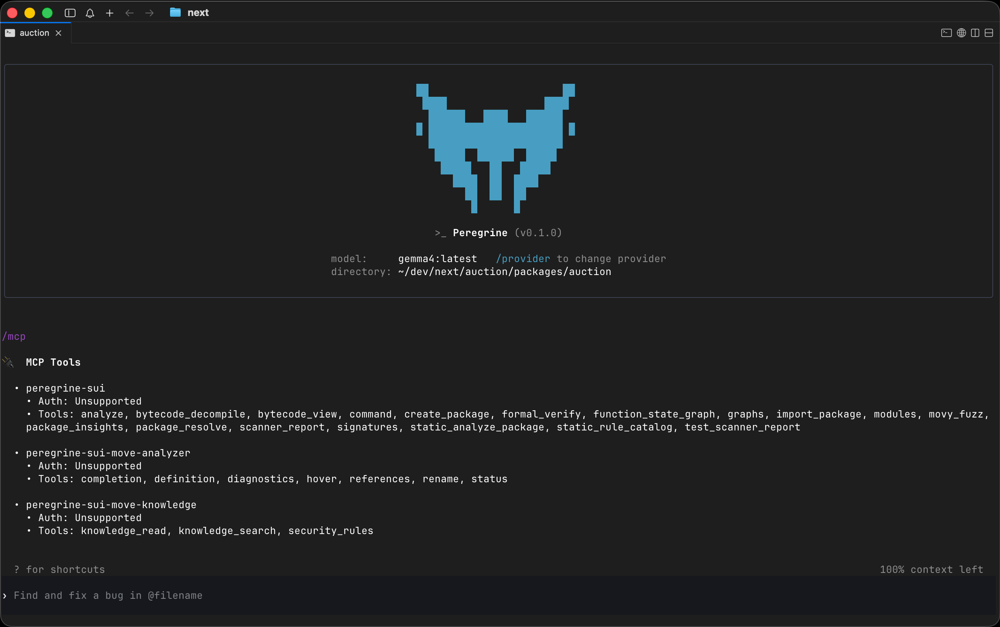
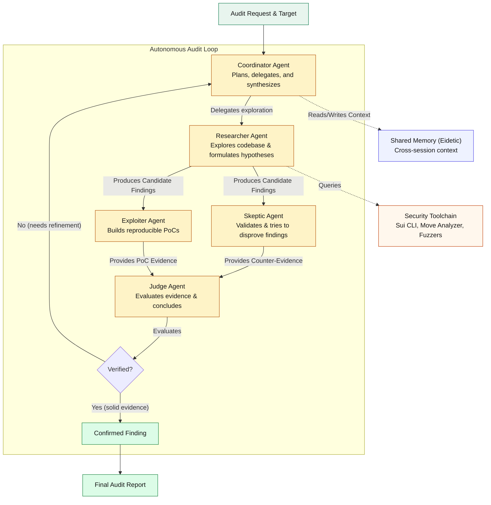

<p align="center">
   <a href="https://mcxross.xyz/">
     
   </a>
</p>

<h3 align="center">Peregrine</h3>

<p align="center">
  Peregrine is what you need when code is secondary and understanding behavior is everything
   <br>
</p>



> [!WARNING]
> **This project is under active development**
>
> Thing are changing rapidly, and the current state of the project may not be stable. Use with caution and expect breaking changes.

## Features

- **Customizable Audit Workflows** — Tailor research and auditing processes to your methodology and requirements
- **Model Agnostic** — Use frontier or open-source models without vendor lock-in
- **Unified Tooling** — Single installation with integrated static analysis and formal verification tooling out of the box
- **TUI/CLI & Desktop** — Run in the terminal, desktop app, or both
- **Built-in Expert Skills** — Specialized capabilities for static analysis, formal verification, and security research tasks
- **Integrated Blockchain Knowledge Base** — Curated blockchain and smart contract knowledge available during analysis
- **Portable Memory** — Preserve context across long-running investigations and research sessions
- **Designed for Long-Running Tasks** — Built to support deep, iterative audits that span multiple sessions
- **Shared Memory** — Shared memory across sessions and other agents to preserve context and avoid redundant analysis

## Quickstart

### Installing and running Peregrine

Run the following on Mac or Linux to install Peregrine:

```shell
curl -fsSL https://mcxross.xyz/peregrine/install.sh | sh
```

Run the following on Windows to install Peregrine:

```powershell
powershell -ExecutionPolicy ByPass -c "irm https://mcxross.xyz/peregrine/install.ps1 | iex"
```

Then simply run `peregrine` to get started.

## Autonomous Audit Flow

Peregrine runs an audit as a coordinator-led investigation. The coordinator keeps the audit plan moving, assigns specialist agents, uses the best available tools for evidence, and only promotes findings that survive adversarial review.



## License

    Copyright 2026 McXross

    Licensed under the Apache License, Version 2.0 (the "License");
    you may not use this file except in compliance with the License.
    You may obtain a copy of the License at

       http://www.apache.org/licenses/LICENSE-2.0

    Unless required by applicable law or agreed to in writing, software
    distributed under the License is distributed on an "AS IS" BASIS,
    WITHOUT WARRANTIES OR CONDITIONS OF ANY KIND, either express or implied.
    See the License for the specific language governing permissions and
    limitations under the License.
